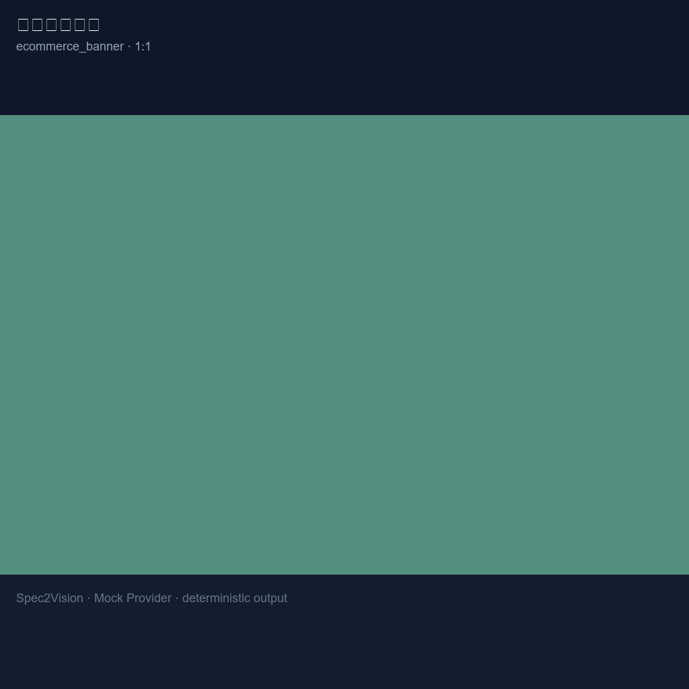
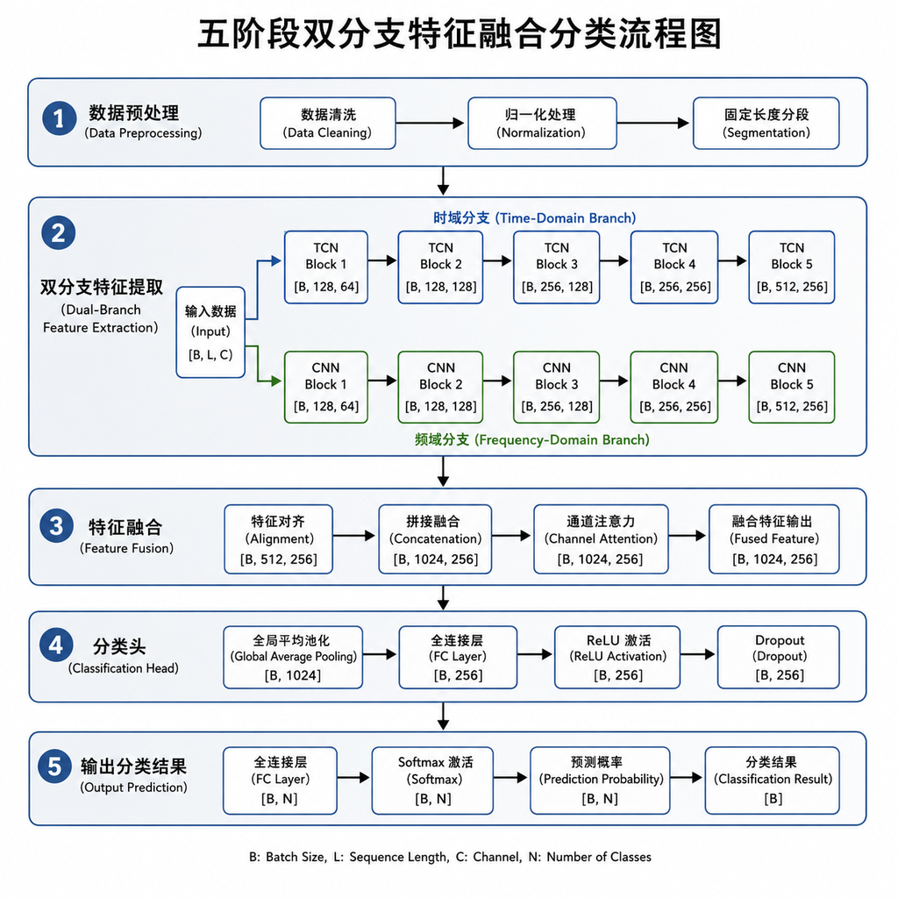
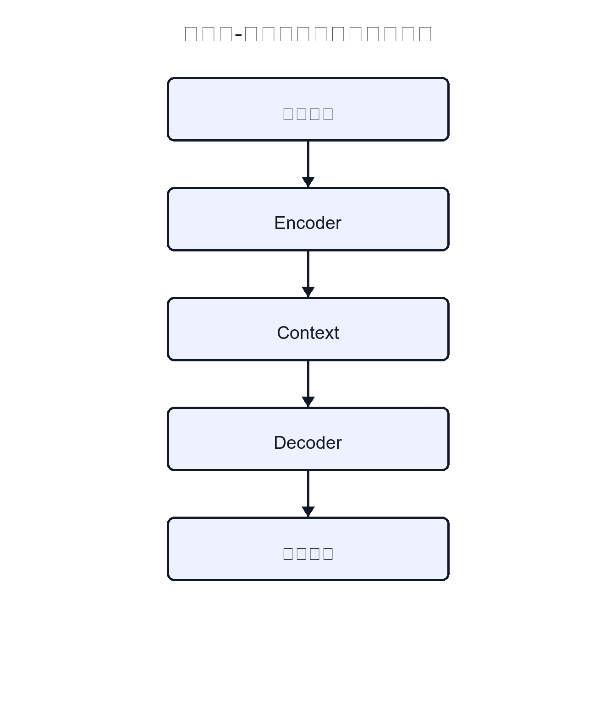
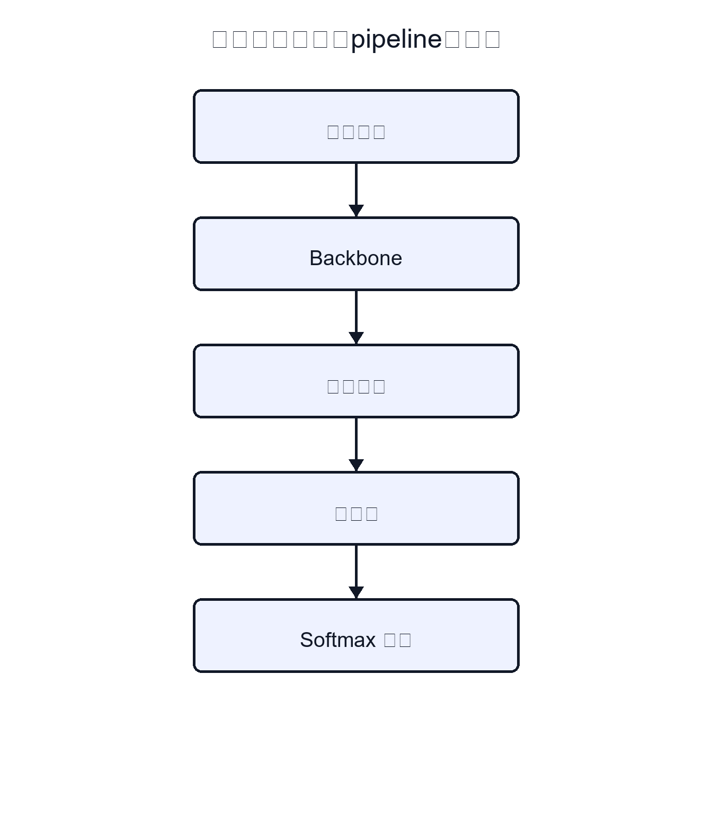
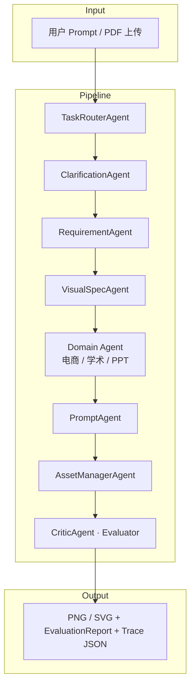

# Spec2Vision

**从一句模糊需求，到可下载的视觉资产 —— 先澄清，再规格化，再生成，再评估**

*Visual Spec 驱动的多 Agent 视觉内容生成 · CS599 Agentic AI 大作业*

## 项目简介

Spec2Vision 是一个 Visual Spec 驱动的多 Agent 视觉内容生成系统。项目将用户的一句模糊需求转化为可下载的视觉资产，完整流程包括任务路由、交互澄清、结构化 Visual Spec 生成、Prompt 构建、图像 / SVG 生成、质量评估与 Agent Trace 记录。

项目主要解决传统视觉生成中需求含糊、Prompt 反复调整、生成过程不可追踪、结果质量难以评估的问题。系统支持电商主图、学术流程图、PPT 视觉封面等典型场景，并提供 Mock Provider，方便在无 API Key 的情况下完成本地验收和复现实验。

## 方向

**方向一：Agentic AI 原生开发**

本项目从零设计并实现一个 Agentic AI 原生应用，围绕视觉内容生成任务构建多 Agent 协作流水线。系统将视觉生成任务拆分为 Router、Clarification、Requirement、Visual Spec、Domain Agent、Prompt、Asset Manager、Evaluator 等多个职责明确的 Agent，并通过 LangGraph / pipeline 进行编排。

## 项目状态

- [x] Proposal
- [x] MVP
- [x] Final

当前版本已完成核心多 Agent 流水线、Mock / OpenAI Provider、Agentic RAG、MCP Tool Server、Evaluator、Trace、API、UI、Docker 与测试集成，并已整理最终答辩所需的文档、Demo 用例与测试报告。

---

## CS599 评分点速览

| 能力                        | 证据                                           |
| --------------------------- | ---------------------------------------------- |
| **SDD / Visual Spec**       | `docs/specs/visual_spec.md`                    |
| **Multi-Agent + LangGraph** | `app/graph/visionflow_graph.py`                |
| **MCP Tool Server**         | `app/mcp/` · `scripts/run_mcp_server.py`       |
| **Agentic RAG**             | `app/rag/` · `data/knowledge_base/`            |
| **Evaluation + Trace**      | `GET /traces/{id}` · `app/tools/evaluator.py`  |
| **Docker / Security / CI**  | `docker-compose.yml` · `app/core/` · 147 tests |

[评分对照](docs/grading_mapping.md) · [答辩清单](docs/final_demo_checklist.md) · **在线 Demo: TODO replace with deployed URL**

[](https://www.python.org/)
[](https://fastapi.tiangolo.com/)
[](https://streamlit.io/)
[](docs/test_report.md)
[](.github/workflows/test.yml)
[](LICENSE)

[效果展示](#-效果展示) · [5 分钟 Demo](#-5-分钟-demo) · [MCP / RAG](#-mcp--agentic-rag) · [快速开始](#-快速开始) · [部署](docs/deployment.md) · [评分对照](docs/grading_mapping.md)

---

## ✨ 效果展示

> **默认 clone 后使用 Mock provider**（无 API Key、可复现）。下方 **9 张 PNG 预览图**由维护者通过 OpenAI Images API 生成，存放于 `docs/images/examples/`。
>
> 老师验收请优先看 [`examples/demo/`](examples/demo/)（Mock 完整工件）或运行 `python benchmark.py --demo examples/ecommerce_case.json`。

### 精选 · 三类典型场景

<table>
  <tr>
    <td width="33%" align="center">
      <br>
      <b>电商主图</b><br>
      <code>ecommerce_banner</code> · 1:1 · PNG<br>
      冰爽0卡 · 夏日冰美式
    </td>
    <td width="33%" align="center">
      <br>
      <b>学术流程图</b><br>
      <code>academic_figure</code> · 4:3 · PNG<br>
      五阶段机器学习方法流水线
    </td>
    <td width="33%" align="center">
      <br>
      <b>PPT 封面</b><br>
      <code>ppt_visual</code> · 16:9 · PNG<br>
      智能驱动 · 未来架构
    </td>
  </tr>
</table>


<details>
<summary><b>更多场景（6 例 · 点击展开）</b></summary>


<br>

<table>
  <tr>
    <td width="50%" align="center">
      <b>电商 · 多比例</b><br>
      <br>
      双11精华液限时特惠 · 16:9
    </td>
    <td width="50%" align="center">
      <b>电商 · 多比例</b><br>
      <br>
      科技缓震 · 轻弹启程 · 16:9
    </td>
  </tr>
  <tr>
    <td width="50%" align="center">
      <b>学术 · 流程图 / 图形摘要</b><br>
      <br>
      编码器-解码器架构数据流 · 16:9
    </td>
    <td width="50%" align="center">
      <b>学术 · 流程图 / 图形摘要</b><br>
      <br>
      计算机视觉实验 pipeline · 4:3
    </td>
  </tr>
  <tr>
    <td width="50%" align="center">
      <b>PPT / 信息图</b><br>
      <br>
      稳健增长：营收攀升轨迹 · 16:9
    </td>
    <td width="50%" align="center">
      <b>PPT / 信息图</b><br>
      <br>
      气候行动 · 从了解开始 · 16:9
    </td>
  </tr>
</table>


</details>

### 样例索引（9 例一览）

| 文件                | 类型 | 比例 | 格式 | Provider |
| ------------------- | ---- | ---- | ---- | -------- |
| `ecommerce_coffee`  | 电商 | 1:1  | PNG  | openai   |
| `ecom_skincare`     | 电商 | 16:9 | PNG  | openai   |
| `ecom_sneakers`     | 电商 | 16:9 | PNG  | openai   |
| `academic_pipeline` | 学术 | 4:3  | PNG  | openai   |
| `acad_graphical`    | 学术 | 16:9 | PNG  | openai   |
| `acad_cv_pipeline`  | 学术 | 4:3  | PNG  | openai   |
| `ppt_cover`         | PPT  | 16:9 | PNG  | openai   |
| `ppt_business`      | PPT  | 16:9 | PNG  | openai   |
| `ppt_infographic`   | PPT  | 16:9 | PNG  | openai   |

元数据：`docs/images/examples/manifest.json` · 用例 JSON：[`examples/`](examples/) · Benchmark：[`benchmarks/examples.jsonl`](benchmarks/examples.jsonl)

---

## 🧩 MCP / Agentic RAG

### MCP Tool Server（stdio）

```bash
python scripts/run_mcp_server.py
# Tools:
# - create_visual_spec
# - generate_visual_asset
# - evaluate_visual_asset
# - query_generation_trace
```

详见 [`docs/examples/mcp_usage.md`](docs/examples/mcp_usage.md) · [`docs/specs/mcp_spec.md`](docs/specs/mcp_spec.md)

### Agentic RAG

```bash
python scripts/ingest_knowledge_base.py
python benchmark.py --demo examples/ecommerce_case.json
# trace.json 含 rag_retrieval 步骤
```

知识库：`data/knowledge_base/`（电商 / 学术 / PPT 规范）· 详见 [`docs/examples/rag_usage.md`](docs/examples/rag_usage.md)

---

## ⏱ 5 分钟 Demo

**无需 API Key** — 与课程验收路径一致：

```bash
cp .env.example .env
# Windows: copy .env.example .env

pip install -r requirements.txt
python -m pytest tests/ -q

# 单案例端到端（Mock PNG / SVG）
python benchmark.py --demo examples/ecommerce_case.json
python benchmark.py --demo examples/academic_case.json
python benchmark.py --demo examples/ppt_case.json

# 查看预导出完整工件（request / spec / prompt / asset / evaluation / trace）
ls examples/demo/ecommerce/
```

预导出样例目录 [`examples/demo/`](examples/demo/) 含三类任务的完整 JSON + 资产文件。

重新导出：

```bash
python scripts/export_demo_cases.py
```

---

## 这个项目解决什么问题？

| 传统做法                  | Spec2Vision                                                  |
| ------------------------- | ------------------------------------------------------------ |
| 写一句 Prompt，碰运气等图 | **Router** 识别任务域（电商 / 学术 / PPT），低置信度时主动 **要求澄清** |
| 需求含糊，反复改 Prompt   | **Clarification** 交互式问卷（平台、比例、风格、合规…）      |
| 生成过程黑盒              | **Visual Spec** 结构化规格 + 全链路 **Agent Trace** JSON     |
| 不知道图好不好            | **分层 Evaluator**：确定性校验 + 图像统计启发式 + **可解释 Rubric** |
| 本地 Demo 依赖付费 Key    | 默认 **Mock Provider**，`clone → pytest → /generate` 全程离线可跑 |

---

## 🚀 快速开始

**30 秒验收路径** — 无需任何 API Key：

```bash
git clone https://github.com/skywalker767/cs599-project.git
cd cs599-project

python -m venv .venv

# Windows
.venv\Scripts\activate

# Linux/macOS
source .venv/bin/activate

pip install -r requirements.txt

# Windows
copy .env.example .env

# Linux/macOS
cp .env.example .env

pytest
make demo
python run.py
```

| 服务         | 地址                         |
| ------------ | ---------------------------- |
| Streamlit UI | http://localhost:8501        |
| FastAPI Docs | http://127.0.0.1:8000/docs   |
| 健康检查     | http://127.0.0.1:8000/health |

**一条 curl 跑通生成 + 下载：**

```bash
curl -s -X POST http://127.0.0.1:8000/generate \
  -H "Content-Type: application/json" \
  -d '{"user_input":"电商促销主图 banner product sale","task_type":"auto","skip_clarification":true}' \
  | python -c "import sys,json; print(json.load(sys.stdin)['task_id'])"

# 将输出的 task_id 代入：
# curl -OJ http://127.0.0.1:8000/tasks/<task_id>/asset
```

---

## 🧱 技术栈

- **AI IDE**: Trae CN
- **LLM**: DeepSeek API / OpenAI API / Mock LLM
- **Agent 编排框架**: LangGraph
- **后端框架**: FastAPI
- **前端界面**: Streamlit
- **图像生成**: OpenAI Images API / Mock Image Provider
- **学术图生成**: 本地 SVG Diagram Generator
- **RAG**: 本地知识库 + Agentic RAG 流程
- **MCP**: MCP Tool Server
- **数据库**: SQLite
- **测试框架**: pytest
- **容器化**: Docker / Docker Compose
- **CI**: GitHub Actions
- **配置管理**: `.env` / `.env.example`

---

## 核心能力

### 1 · 智能路由（Router）

- 加权关键词 / 正则 → 电商 · 学术 · PPT 三类任务
- 输出 `confidence` · `reasoning` · `matched_signals` · `clarification_required`
- **模糊输入不再盲目归为 `ppt_visual`**
- `confidence < 0.45` 时返回澄清问题

### 2 · 交互澄清（Clarification）

- 领域模板题库（平台 / 比例 / 风格 / 合规 / 图类型…）
- 可选 LLM 动态题（需 API Key）
- Mock 模式下纯模板同样可跑通

### 3 · Visual Spec → Prompt → 生成

- 结构化规格：`title` · `key_elements` · `constraints` · 领域扩展字段
- PNG：`MockImageGenerator`（离线确定性）或 OpenAI Images API
- SVG：学术流程图由本地 `DiagramGenerator` 离线渲染

### 4 · 可解释评估（Evaluator）

| 层                |  离线  | 作用                                                         |
| ----------------- | :----: | ------------------------------------------------------------ |
| A · Deterministic |   ✅    | 格式有效、尺寸合规、SVG 节点、prompt/spec 对齐               |
| B · Heuristic     |   ✅    | entropy / 对比度 / 边缘密度 / 空白检测                       |
| C · VLM           | 需 Key | 可选语义与美学评分                                           |
| **Rubric**        |   ✅    | 6 维可审计：`visual_validity` · `spec_completeness` · `requirement_alignment` · `domain_fit` · `traceability` · `reproducibility` |

### 5 · 全链路 Trace

每个 Agent 步骤记录 `pipeline_step` · 耗时 · provider · warnings，支持 UI 时间线与 JSON 导出。

---

## 架构与流水线



**Trace 关键阶段：**

`router_decision` → `clarification_needed` → `visual_spec_created` → `prompt_created` → `provider_selected` → `output_generated` → `evaluation_completed`

Trace JSON 片段：

```json
{
  "step": "generate_asset",
  "agent_name": "AssetManagerAgent",
  "metadata": {
    "pipeline_step": "output_generated",
    "provider": "mock",
    "generation_mode": "mock",
    "requested_aspect_ratio": "1:1",
    "resolved_width": 1024,
    "resolved_height": 1024
  },
  "duration_ms": 45
}
```

---

## ⚙️ 配置一览

`.env.example` 默认即可离线运行（**无需填写 API Key**）：

| 变量                        | 默认    | 必填？           | 说明                                           |
| --------------------------- | ------- | ---------------- | ---------------------------------------------- |
| `IMAGE_PROVIDER`            | `mock`  | 否               | `mock` 离线 PNG · `openai` 需 `OPENAI_API_KEY` |
| `LLM_PROVIDER`              | `mock`  | 否               | `mock` 离线 · `deepseek` / `openai` 需对应 Key |
| `OPENAI_API_KEY`            | 空      | 仅 openai 模式   | 图像 / LLM OpenAI                              |
| `DEEPSEEK_API_KEY`          | 空      | 仅 deepseek 模式 | 文本 LLM                                       |
| `DEMO_MODE`                 | `false` | 否               | `true` 强制 Mock                               |
| `VISION_EVALUATOR_PROVIDER` | `none`  | 否               | `openai` 可选 VLM（需 Key）                    |
| `OCR_PROVIDER`              | `none`  | 否               | 扫描 PDF OCR 预留，默认关闭                    |

**Mock vs OpenAI：**

| 组件     | Mock（默认）                     | OpenAI            |
| -------- | -------------------------------- | ----------------- |
| 文本 LLM | `MockLLM` 确定性 JSON            | DeepSeek / OpenAI |
| 图像     | 标准库 PNG + `.mock.json` 元数据 | Images API        |
| 学术 SVG | 本地 `DiagramGenerator`          | 同左              |
| 评估     | 确定性 + 启发式 + Rubric         | 同左 + 可选 VLM   |

---

## Aspect Ratio 映射

`app/tools/aspect_ratio.py`：**理想尺寸 → API 支持尺寸** 两层映射。

| 请求比例 | 理想尺寸  | API 实际尺寸 |
| -------- | --------- | ------------ |
| 1:1      | 1024×1024 | 1024×1024    |
| 16:9     | 1536×864  | 1792×1024    |
| 9:16     | 864×1536  | 1024×1792    |
| 4:3      | 1280×960  | 1536×1024    |
| 4:5      | 1024×1280 | 1024×1536    |

元数据字段：`requested_aspect_ratio` · `resolved_width` · `resolved_height` · `provider`

---

## Benchmark

**Smoke / 回归套件** — 12 个 JSONL 用例，验证路由 + 生成 + 启发式评估链路：

```bash
python benchmark.py --benchmark
# 或
make benchmark
```

测试阈值：`routing_accuracy >= 0.75`（见 `tests/test_benchmark.py`）。

| 指标（Mock smoke 示例）       | 值                         |
| ----------------------------- | -------------------------- |
| routing_accuracy              | ≥ 75%                      |
| generation_success_rate       | 100%                       |
| evaluator_avg_score (offline) | ~58（Mock 占位图预期偏低） |

Mock 纯色占位图会触发 blank / low-entropy 检测，离线分偏低是设计预期。详见 [`docs/fix_report.md`](docs/fix_report.md)。

---

## API 一览

| 方法     | 路径                | 说明                                        |
| -------- | ------------------- | ------------------------------------------- |
| `GET`    | `/health`           | 健康检查（含 provider 信息）                |
| `POST`   | `/extract`          | 上传 PDF / TXT；扫描件返回 `needs_ocr=true` |
| `POST`   | `/clarify`          | 澄清选择题                                  |
| `POST`   | `/generate`         | **完整生成流水线**                          |
| `GET`    | `/tasks`            | 分页任务列表                                |
| `GET`    | `/tasks/{id}`       | 任务详情（含 evaluation.rubric）            |
| `GET`    | `/tasks/{id}/asset` | 下载 PNG / SVG                              |
| `DELETE` | `/tasks/{id}`       | 删除任务                                    |

---

## UI Usage

Streamlit 界面展示：

- 路由结果与 Visual Spec 结构化预览
- 生成资产预览 + **Rubric 分项评分**（含 rationale / evidence）
- Agent Trace 时间线（`pipeline_step` · 耗时 · warnings）
- Mock 模式与 OpenAI 模式 UI 一致

---

## Testing

**147 passed, 1 skipped** · 默认 Mock · 无外部 API · 可验证报告：[`docs/test_report.md`](docs/test_report.md)

```bash
cp .env.example .env && python -m pytest tests/ -v

# 验收路径
python scripts/validate_repo_format.py

# 防止单行压缩回归
python -m compileall -q app tests scripts benchmark.py

make test
make lint
make smoke
make rag-ingest
make mcp
make coverage
```

CI：

- [`.github/workflows/test.yml`](.github/workflows/test.yml)：format + compile + pytest
- [`.github/workflows/ci.yml`](.github/workflows/ci.yml)：ruff + pytest

覆盖亮点：Mock 端到端 · 配置一致性 · Router 澄清 · Evaluator rubric · API 错误路径 · `examples/demo/` 工件

---

## PDF 处理

| 类型       | 行为                                         |
| ---------- | -------------------------------------------- |
| 文本 PDF   | 抽取 + LLM / 启发式摘要 → `document_context` |
| 空 PDF     | 明确错误                                     |
| 扫描 PDF   | `needs_ocr=true` + `extraction_warning`      |
| `.pptx` 等 | 明确拒绝                                     |

---

## CS599 期末报告与封面信息

| 文件                                                     | 说明             |
| -------------------------------------------------------- | ---------------- |
| [`docs/CS599_大作业报告.md`](docs/CS599_大作业报告.md)   | 期末报告源文件   |
| [`docs/CS599_大作业报告.pdf`](docs/CS599_大作业报告.pdf) | 导出的 PDF       |
| [`docs/student_info.json`](docs/student_info.json)       | 封面个人信息配置 |

更新姓名、学号、专业、部署 URL 等信息时，只需编辑 JSON 并运行脚本：

```bash
# 第一次生成个人信息模板
python scripts/update_report_personal_info.py

# 编辑 docs/student_info.json 后，只更新 Markdown 中的封面信息
python scripts/update_report_personal_info.py

# 更新封面信息并重新导出 PDF
python scripts/update_report_personal_info.py --build-pdf
```

生成 PNG 架构图与完整 PDF：

```bash
python scripts/generate_report_figures.py
python scripts/generate_report_pdf.py
```

---

## 文档

| 文档                                                         | 内容             |
| ------------------------------------------------------------ | ---------------- |
| [`docs/specs/product_spec.md`](docs/specs/product_spec.md)   | 产品范围与 MVP   |
| [`docs/specs/architecture_spec.md`](docs/specs/architecture_spec.md) | 架构设计         |
| [`docs/specs/agent_workflow_spec.md`](docs/specs/agent_workflow_spec.md) | Agent 工作流     |
| [`docs/specs/evaluation_spec.md`](docs/specs/evaluation_spec.md) | 评估规范         |
| [`docs/specs/api_spec.md`](docs/specs/api_spec.md)           | API 契约         |
| [`docs/demo/demo_script.md`](docs/demo/demo_script.md)       | 课堂 Demo 脚本   |
| [`docs/grading_mapping.md`](docs/grading_mapping.md)         | CS599 评分点映射 |
| [`docs/final_demo_checklist.md`](docs/final_demo_checklist.md) | 答辩检查清单     |

架构图源：`docs/images/*.mmd`（Mermaid 源文件）。

---

## Architecture Notes

| 能力     | 当前实现                                                    | 需要 Key？ |
| -------- | ----------------------------------------------------------- | :--------: |
| 任务路由 | 规则基线 + 可选 LLM 精修；低置信 → `clarification_required` |     否     |
| 澄清     | 模板题库 + 哈希轮换；LLM 动态题可选                         |     否     |
| 文本 LLM | Mock / DeepSeek / OpenAI                                    |  Mock 否   |
| 图像     | Mock PNG（标准库）/ OpenAI Images API                       |  Mock 否   |
| 学术 SVG | 本地 DiagramGenerator                                       |     否     |
| 评估     | 启发式 + Rubric；VLM 可选                                   |   离线否   |

---

## Makefile 命令

```bash
make install      # venv + 依赖 + .env.example
make test         # pytest
make coverage     # 覆盖率
make demo         # 离线 CLI Demo
make benchmark    # 12 用例基准
make lint         # ruff
make format       # black / ruff format
make dev          # python run.py
```

---

## 📁 目录结构

```text
cs599-project/
├── app/
│   ├── agents/          # 多 Agent 实现：Router / Clarification / Requirement / Spec / Prompt / Evaluator 等
│   ├── graph/           # LangGraph 编排与 pipeline fallback
│   ├── tools/           # 图像生成、SVG 生成、评估器、文档处理、benchmark 工具
│   ├── services/        # 业务服务层，例如 GenerationService
│   ├── models/          # Pydantic 数据模型与 SQLite 任务模型
│   ├── rag/             # Agentic RAG 检索、索引与知识库调用
│   ├── mcp/             # MCP Tool Server 相关实现
│   ├── core/            # 配置、安全、日志等基础能力
│   └── ui/              # Streamlit 前端界面
├── data/
│   └── knowledge_base/  # RAG 本地知识库
├── docs/                # 产品文档、架构文档、评分映射、报告与 Demo 脚本
├── examples/            # 电商、学术、PPT 三类端到端样例
├── benchmarks/          # benchmark JSONL 用例与结果
├── tests/               # pytest 测试用例
├── scripts/             # Demo、MCP、RAG ingest、报告生成等脚本
├── .github/workflows/   # GitHub Actions CI
├── docker-compose.yml   # Docker Compose 配置
├── Dockerfile           # Docker 镜像构建文件
├── requirements.txt     # Python 依赖
├── run.py               # 本地启动入口
└── README.md
```

> 注：本项目主要源码目录是 `app/`，职责上对应课程模板中的 `src/`。

---

## ❓ Troubleshooting

| 问题                     | 解决                                                         |
| ------------------------ | ------------------------------------------------------------ |
| `Image API key required` | 设置 `IMAGE_PROVIDER=mock`，或配置 `OPENAI_API_KEY`          |
| `Unknown IMAGE_PROVIDER` | 仅支持 `mock` / `openai`                                     |
| 测试失败                 | `pip install -r requirements.txt`；确认 Python 3.11+         |
| Mock 评估分低            | Mock 占位图会触发部分启发式检测，可使用 OpenAI Images API 生成真实图像 |
| 扫描 PDF 无文本          | 查看 `needs_ocr`；OCR 默认未启用                             |

---

## License

[MIT](LICENSE)
