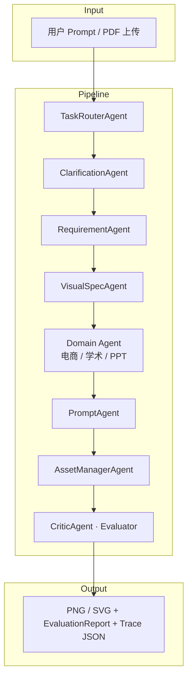

<div align="center">

# Spec2Vision

**从一句模糊需求，到可下载的视觉资产 —— 先澄清，再规格化，再生成，再评估**

*Visual Spec 驱动的多智能体视觉内容生成 · CS599 课程项目原型*

<br>

[](https://www.python.org/)
[](https://fastapi.tiangolo.com/)
[](https://streamlit.io/)
[](docs/test_report.md)
[](.github/workflows/test.yml)
[](LICENSE)

[效果展示](#-效果展示) · [5 分钟 Demo](#-5-分钟-demo) · [快速开始](#-快速开始) · [修复说明](docs/fix_report.md) · [测试报告](docs/test_report.md)

<br>

</div>

---

## ✨ 效果展示

> **默认 clone 后使用 Mock provider**（无 API Key、可复现）。下方预览图为维护者用 OpenAI Images API **可选生成**的静态样例（PNG），存放于 `docs/images/examples/`。
>
> 老师验收请优先看 [`examples/demo/`](examples/demo/)（Mock 完整工件）或运行 `python benchmark.py --demo examples/ecommerce_case.json`。

### 精选 · 三类典型场景

<table>
  <tr>
    <td align="center" width="33%">
      <a href="docs/images/examples/ecommerce_coffee.png">
        
      </a>
      <br><br>
      <b>🛒 电商主图</b><br>
      <code>ecommerce_banner</code> · 1:1 · PNG<br>
      <sub>冰爽0卡·夏日冰美式</sub>
    </td>
    <td align="center" width="33%">
      <a href="docs/images/examples/academic_pipeline.png">
        
      </a>
      <br><br>
      <b>📊 学术流程图</b><br>
      <code>academic_figure</code> · 4:3 · PNG<br>
      <sub>五阶段机器学习方法流水线</sub>
    </td>
    <td align="center" width="33%">
      <a href="docs/images/examples/ppt_cover.png">
        
      </a>
      <br><br>
      <b>🎓 PPT 封面</b><br>
      <code>ppt_visual</code> · 16:9 · PNG<br>
      <sub>智能驱动·未来架构</sub>
    </td>
  </tr>
</table>

<details>
<summary><b>📂 更多场景（6 例 · 点击展开）</b></summary>

<br>

**电商 · 多比例**

<table>
  <tr>
    <td align="center" width="50%">
      <a href="docs/images/examples/ecom_skincare.png"></a><br>
      <sub>双11精华液限时特惠 · 16:9</sub>
    </td>
    <td align="center" width="50%">
      <a href="docs/images/examples/ecom_sneakers.png"></a><br>
      <sub>科技缓震·轻弹启程 · 16:9</sub>
    </td>
  </tr>
</table>

**学术 · 流程图 / 图形摘要**

<table>
  <tr>
    <td align="center" width="50%">
      <a href="docs/images/examples/acad_graphical.png"></a><br>
      <sub>编码器-解码器架构数据流 · 16:9</sub>
    </td>
    <td align="center" width="50%">
      <a href="docs/images/examples/acad_cv_pipeline.png"></a><br>
      <sub>计算机视觉实验 pipeline · 4:3</sub>
    </td>
  </tr>
</table>

**PPT / 信息图**

<table>
  <tr>
    <td align="center" width="50%">
      <a href="docs/images/examples/ppt_business.png"></a><br>
      <sub>稳健增长：营收攀升轨迹 · 16:9</sub>
    </td>
    <td align="center" width="50%">
      <a href="docs/images/examples/ppt_infographic.png"></a><br>
      <sub>气候行动·从了解开始 · 16:9</sub>
    </td>
  </tr>
</table>

</details>

<details>
<summary><b>📋 样例索引（9 例一览）</b></summary>

| 文件 | 类型 | 比例 | 格式 | Provider |
|------|------|------|------|----------|
| `ecommerce_coffee` | 电商 | 1:1 | PNG | openai |
| `ecom_skincare` | 电商 | 16:9 | PNG | openai |
| `ecom_sneakers` | 电商 | 16:9 | PNG | openai |
| `academic_pipeline` | 学术 | 4:3 | PNG | diagram (PNG) |
| `acad_graphical` | 学术 | 16:9 | PNG | diagram (PNG) |
| `acad_cv_pipeline` | 学术 | 4:3 | PNG | diagram (PNG) |
| `ppt_cover` | PPT | 16:9 | PNG | openai |
| `ppt_business` | PPT | 16:9 | PNG | openai |
| `ppt_infographic` | PPT | 16:9 | PNG | openai |

元数据：`docs/images/examples/manifest.json` · 用例 JSON：[`examples/`](examples/) · Benchmark：[`benchmarks/examples.jsonl`](benchmarks/examples.jsonl)

</details>

---

## ⏱ 5 分钟 Demo

**无需 API Key** — 与课程验收路径一致：

```bash
cp .env.example .env          # Windows: copy .env.example .env
pip install -r requirements.txt
python -m pytest tests/ -q      # 129 passed

# 单案例端到端（Mock PNG / SVG）
python benchmark.py --demo examples/ecommerce_case.json
python benchmark.py --demo examples/academic_case.json
python benchmark.py --demo examples/ppt_case.json

# 查看预导出完整工件（request / spec / prompt / asset / evaluation / trace）
ls examples/demo/ecommerce/
```

预导出样例目录 [`examples/demo/`](examples/demo/) 含三类任务的完整 JSON + 资产文件。重新导出：

```bash
python scripts/export_demo_cases.py
```

---

## 💡 这个项目解决什么问题？

| 传统做法 | Spec2Vision |
|----------|-------------|
| 写一句 Prompt，碰运气等图 | **Router** 识别任务域（电商 / 学术 / PPT），低置信度时主动 **要求澄清** |
| 需求含糊，反复改 Prompt | **Clarification** 交互式问卷（平台、比例、风格、合规…） |
| 生成过程黑盒 | **Visual Spec** 结构化规格 + 全链路 **Agent Trace** JSON |
| 不知道图好不好 | **分层 Evaluator**：确定性校验 + 图像统计启发式 + **可解释 Rubric** |
| 本地 Demo 依赖付费 Key | 默认 **Mock Provider**，`clone → pytest → /generate` 全程离线可跑 |

> **诚实说明**：这是 **课程项目原型（course project prototype）**，不是生产级系统。
> 路由以规则 + 可选 LLM 精修为主；评估是启发式 rubric，不是人类审美模型。详见 [Architecture Notes](#-architecture-notes诚实说明)。

---

## 🚀 快速开始

**30 秒验收路径** — 无需任何 API Key：

```bash
git clone https://github.com/skywalker767/Spec2Vision.git
cd Spec2Vision

python -m venv .venv
# Windows:  .venv\Scripts\activate
# Linux/macOS: source .venv/bin/activate

pip install -r requirements.txt
copy .env.example .env          # Windows
# cp .env.example .env          # Linux/macOS

pytest                          # 129 passed · 全程 Mock · 无网络
make demo                       # 命令行单次生成 Demo
python run.py                   # 启动 Streamlit UI + FastAPI
```

| 服务 | 地址 |
|------|------|
| Streamlit UI | http://localhost:8501 |
| FastAPI Docs | http://127.0.0.1:8000/docs |
| 健康检查 | http://127.0.0.1:8000/health |

**一条 curl 跑通生成 + 下载：**

```bash
curl -s -X POST http://127.0.0.1:8000/generate \
  -H "Content-Type: application/json" \
  -d '{"user_input":"电商促销主图 banner product sale","task_type":"auto","skip_clarification":true}' \
  | python -c "import sys,json; print(json.load(sys.stdin)['task_id'])"
# 将输出的 task_id 代入：
# curl -OJ http://127.0.0.1:8000/tasks/<task_id>/asset
```

---

## 🧩 核心能力

### 1 · 智能路由（Router）

- 加权关键词 / 正则 → 电商 · 学术 · PPT 三类任务
- 输出 `confidence` · `reasoning` · `matched_signals` · `clarification_required`
- **模糊输入不再盲目归为 `ppt_visual`**；`confidence < 0.45` 时返回澄清问题

### 2 · 交互澄清（Clarification）

- 领域模板题库（平台 / 比例 / 风格 / 合规 / 图类型…）
- 可选 LLM 动态题（需 API Key）；Mock 模式下纯模板同样可跑通

### 3 · Visual Spec → Prompt → 生成

- 结构化规格：`title` · `key_elements` · `constraints` · 领域扩展字段
- PNG：`MockImageGenerator`（离线确定性）或 OpenAI Images API
- SVG：学术流程图由本地 `DiagramGenerator` 离线渲染

### 4 · 可解释评估（Evaluator）

| 层 | 离线 | 作用 |
|----|:----:|------|
| A · Deterministic | ✅ | 格式有效、尺寸合规、SVG 节点、prompt/spec 对齐 |
| B · Heuristic | ✅ | entropy / 对比度 / 边缘密度 / 空白检测 |
| C · VLM | 需 Key | 可选语义与美学评分 |
| **Rubric** | ✅ | 6 维可审计：`visual_validity` · `spec_completeness` · `requirement_alignment` · `domain_fit` · `traceability` · `reproducibility` |

### 5 · 全链路 Trace

每个 Agent 步骤记录 `pipeline_step` · 耗时 · provider · warnings，支持 UI 时间线与 JSON 导出。

---

## 🏗 架构与流水线



**Trace 关键阶段：**

`router_decision` → `clarification_needed` → `visual_spec_created` → `prompt_created` → `provider_selected` → `output_generated` → `evaluation_completed`

<details>
<summary><b>Trace JSON 片段</b></summary>

```json
{
  "step": "generate_asset",
  "agent_name": "AssetManagerAgent",
  "metadata": {
    "pipeline_step": "output_generated",
    "provider": "mock",
    "generation_mode": "mock",
    "requested_aspect_ratio": "1:1",
    "resolved_width": 1024,
    "resolved_height": 1024
  },
  "duration_ms": 45
}
```

</details>

---

## ⚙️ 配置一览

`.env.example` 默认即可离线运行（**无需填写 API Key**）：

| 变量 | 默认 | 必填？ | 说明 |
|------|------|--------|------|
| `IMAGE_PROVIDER` | `mock` | 否 | `mock` 离线 PNG · `openai` 需 `OPENAI_API_KEY` |
| `LLM_PROVIDER` | `mock` | 否 | `mock` 离线 · `deepseek`/`openai` 需对应 Key |
| `OPENAI_API_KEY` | 空 | 仅 openai 模式 | 图像/LLM OpenAI |
| `DEEPSEEK_API_KEY` | 空 | 仅 deepseek 模式 | 文本 LLM |
| `DEMO_MODE` | `false` | 否 | `true` 强制 Mock |
| `VISION_EVALUATOR_PROVIDER` | `none` | 否 | `openai` 可选 VLM（需 Key） |
| `OCR_PROVIDER` | `none` | 否 | 扫描 PDF OCR 预留，默认关闭 |

**Mock vs OpenAI：**

| 组件 | Mock（默认） | OpenAI |
|------|-------------|--------|
| 文本 LLM | `MockLLM` 确定性 JSON | DeepSeek / OpenAI |
| 图像 | 标准库 PNG + `.mock.json` 元数据 | Images API |
| 学术 SVG | 本地 `DiagramGenerator` | 同左 |
| 评估 | 确定性 + 启发式 + Rubric | 同左 + 可选 VLM |

---

## 📐 Aspect Ratio 映射

`app/tools/aspect_ratio.py`：**理想尺寸 → API 支持尺寸** 两层映射。

| 请求比例 | 理想尺寸 | API 实际尺寸 |
|----------|----------|-------------|
| 1:1 | 1024×1024 | 1024×1024 |
| 16:9 | 1536×864 | 1792×1024 |
| 9:16 | 864×1536 | 1024×1792 |
| 4:3 | 1280×960 | 1536×1024 |
| 4:5 | 1024×1280 | 1024×1536 |

元数据字段：`requested_aspect_ratio` · `resolved_width` · `resolved_height` · `provider`

---

## 📊 Benchmark

**Smoke / 回归套件**（非严谨 ML benchmark）— 12 个 JSONL 用例，验证路由 + 生成 + 启发式评估链路：

```bash
python benchmark.py --benchmark
# 或
make benchmark
```

测试阈值：`routing_accuracy >= 0.75`（见 `tests/test_benchmark.py`）。指标仅供回归，不代表真实业务 KPI。

| 指标（Mock smoke 示例） | 值 |
|----------------------|-----|
| routing_accuracy | ≥ 75% |
| generation_success_rate | 100% |
| evaluator_avg_score (offline) | ~58（Mock 占位图预期偏低） |

> Mock 纯色占位图会触发 blank/low-entropy 检测，离线分偏低是**设计预期**。详见 [`docs/fix_report.md`](docs/fix_report.md)。

---

## 🔌 API 一览

| 方法 | 路径 | 说明 |
|------|------|------|
| `GET` | `/health` | 健康检查（含 provider 信息） |
| `POST` | `/extract` | 上传 PDF/TXT；扫描件返回 `needs_ocr=true` |
| `POST` | `/clarify` | 澄清选择题 |
| `POST` | `/generate` | **完整生成流水线** |
| `GET` | `/tasks` | 分页任务列表 |
| `GET` | `/tasks/{id}` | 任务详情（含 evaluation.rubric） |
| `GET` | `/tasks/{id}/asset` | 下载 PNG/SVG |
| `DELETE` | `/tasks/{id}` | 删除任务 |

---

## 🖥 UI Usage

Streamlit 界面展示：

- 路由结果与 Visual Spec 结构化预览
- 生成资产预览 + **Rubric 分项评分**（含 rationale / evidence）
- Agent Trace 时间线（`pipeline_step` · 耗时 · warnings）
- Mock 模式与 OpenAI 模式 UI 一致

---

## 🧪 Testing

**129 passed, 1 skipped** · 默认 Mock · 无外部 API · 可验证报告：[`docs/test_report.md`](docs/test_report.md)

```bash
cp .env.example .env && python -m pytest tests/ -v    # 验收路径
python scripts/validate_repo_format.py               # 防止单行压缩回归
python -m compileall -q app tests scripts benchmark.py
make test
make lint          # ruff
make format        # black
make coverage      # ≥80% 核心模块
```

CI：[`.github/workflows/test.yml`](.github/workflows/test.yml)（format + compile + pytest）· [`.github/workflows/ci.yml`](.github/workflows/ci.yml)（ruff + pytest）· **无需 secrets**

覆盖亮点：Mock 端到端 · 配置一致性 · Router 澄清 · Evaluator rubric · API 错误路径 · `examples/demo/` 工件

---

## 📄 PDF 处理

| 类型 | 行为 |
|------|------|
| 文本 PDF | 抽取 + LLM/启发式摘要 → `document_context` |
| 空 PDF | 明确错误 |
| 扫描 PDF | `needs_ocr=true` + `extraction_warning`（不误报成功） |
| .pptx 等 | 明确拒绝 |

---

## 📚 文档

| 文档 | 内容 |
|------|------|
| [`docs/specs/product_spec.md`](docs/specs/product_spec.md) | 产品范围与 MVP |
| [`docs/specs/architecture_spec.md`](docs/specs/architecture_spec.md) | 架构设计 |
| [`docs/specs/agent_workflow_spec.md`](docs/specs/agent_workflow_spec.md) | Agent 工作流 |
| [`docs/specs/evaluation_spec.md`](docs/specs/evaluation_spec.md) | 评估规范 |
| [`docs/specs/api_spec.md`](docs/specs/api_spec.md) | API 契约 |
| [`docs/demo/demo_script.md`](docs/demo/demo_script.md) | 课堂 Demo 脚本 |

架构图源：`docs/images/*.mmd`（Mermaid 源文件）

---

## 🔍 Architecture Notes（诚实说明）

| 能力 | 真实实现 | 需要 Key？ |
|------|----------|:----------:|
| 任务路由 | 规则基线 + 可选 LLM 精修；低置信 → `clarification_required` | 否 |
| 澄清 | 模板题库 + 哈希轮换；LLM 动态题可选 | 否 |
| 文本 LLM | Mock / DeepSeek / OpenAI | Mock 否 |
| 图像 | Mock PNG（标准库）/ OpenAI Images API | Mock 否 |
| 学术 SVG | 本地 DiagramGenerator | 否 |
| 评估 | 启发式 + Rubric；VLM 可选 | 离线否 |

**不是生产级系统**：无鉴权、限流、监控、多租户。它是一个**可复现、文档与实现一致、测试可信**的课程原型。

---

## 🛠 Makefile 命令

```bash
make install          # venv + 依赖 + .env.example
make test             # pytest（129 passed）
make coverage         # ≥80% 覆盖率
make demo             # 离线 CLI Demo
make benchmark        # 12 用例基准
make lint / format    # ruff / black
make dev              # python run.py
```

---

## 📁 项目结构

```
Spec2Vision/
├── app/
│   ├── agents/              # 11 个 Agent（Router / Clarification / Spec / …）
│   ├── graph/               # LangGraph 编排 + pipeline fallback
│   ├── tools/               # 图像 / 评估 / 文档 / benchmark
│   ├── services/            # GenerationService
│   ├── models/              # Pydantic + SQLite
│   └── ui/                  # Streamlit
├── docs/images/examples/    # README 展示图（可 regenerate）
├── examples/                # 三类端到端用例 JSON
├── benchmarks/              # 12 基准用例 + results
├── tests/                   # 129 个测试
├── scripts/
│   ├── run_demo.py
│   └── generate_readme_examples.py
├── .github/workflows/ci.yml
└── README.md
```

---

## ❓ Troubleshooting

| 问题 | 解决 |
|------|------|
| `Image API key required` | 设置 `IMAGE_PROVIDER=mock`（默认），或配置 `OPENAI_API_KEY` |
| `Unknown IMAGE_PROVIDER` | 仅支持 `mock` / `openai` |
| 测试失败 | `pip install -r requirements.txt` · Python 3.11+ · 无需 Key |
| Mock 评估分低 | 预期行为（纯色占位图） |
| 扫描 PDF 无文本 | 查看 `needs_ocr`；OCR 默认未启用 |

---

## License

[MIT](LICENSE)
