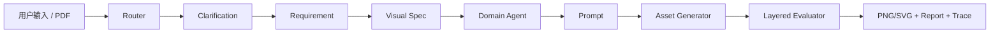

<div align="center">

# Spec2Vision

### Visual Spec 驱动的多智能体视觉内容生成平台

**先澄清 · 再规格化 · 再生成 · 再评估**

*企业级应用软件设计与开发 · CS599 · Agentic AI 原生开发*

<br>

[](https://www.python.org/)
[](https://fastapi.tiangolo.com/)
[](https://streamlit.io/)
[](tests/)
[](.coveragerc)

[快速开始](#快速开始) · [Mock Demo](#offline-demo-mock-provider) · [评估设计](#evaluator-design) · [Benchmark](#benchmark) · [API](#api-一览)

</div>

---

## Project Overview

Spec2Vision 将「写一句 Prompt 碰运气」升级为 **多 Agent 协作的结构化视觉生产流水线**：

1. **路由** — 电商 / 学术 / PPT 三类任务
2. **澄清** — 交互式偏好问卷
3. **Visual Spec** — 结构化视觉规格
4. **生成** — PNG（图像 API 或 Mock）/ SVG（学术流程图）
5. **分层评估** — 确定性 + 启发式 + 可选 VLM
6. **Trace** — 全链路可观测 JSON

---

## Architecture & Pipeline



**Trace 关键步骤（`pipeline_step`）：**

`router_decision` → `clarification_needed` → `visual_spec_created` → `prompt_created` → `provider_selected` → `output_generated` → `evaluation_completed`

<details>
<summary><b>Trace 示例（节选）</b></summary>

```json
[
  {
    "step": "route_task",
    "agent_name": "TaskRouterAgent",
    "metadata": { "pipeline_step": "router_decision", "task_type": "ecommerce_banner" },
    "duration_ms": 12,
    "warnings": []
  },
  {
    "step": "generate_asset",
    "agent_name": "AssetManagerAgent",
    "metadata": {
      "pipeline_step": "output_generated",
      "provider": "mock",
      "requested_aspect_ratio": "1:1",
      "resolved_width": 1024,
      "resolved_height": 1024
    },
    "duration_ms": 45
  }
]
```

</details>

---

## 快速开始

### 环境要求

- Python **3.11+**
- 无需 API Key 即可运行 Mock Demo 与全部测试

### 1. 安装

```bash
git clone https://github.com/skywalker767/Spec2Vision.git
cd Spec2Vision

make install
# 或手动：
# python -m venv .venv && source .venv/bin/activate  # Linux/macOS
# .venv\Scripts\activate                             # Windows
# pip install -r requirements.txt
# copy .env.example .env
```

### 2. 配置（`.env`）

**默认即可离线运行** — `.env.example` 已设置 `IMAGE_PROVIDER=mock`、`LLM_PROVIDER=mock`。

| 变量 | 默认值 | 说明 |
|------|--------|------|
| `IMAGE_PROVIDER` | `mock` | `mock` 离线占位图；`openai` 真实图像 API |
| `LLM_PROVIDER` | `mock` | `mock` / `deepseek` / `openai` |
| `DEMO_MODE` | `false` | `true` 时强制 Mock LLM + Mock 图像 |
| `VISION_EVALUATOR_PROVIDER` | `none` | `openai` 时启用可选 VLM 评分（需 API Key） |
| `OCR_PROVIDER` | `none` | 扫描 PDF OCR 预留接口，默认不启用 |

### 3. 启动

```bash
# 一键 CLI Demo（无需启动服务）
make demo

# 完整 UI + API
python run.py
# Windows: .\start.ps1
```

| 服务 | 地址 |
|------|------|
| Streamlit UI | http://localhost:8501 |
| FastAPI | http://127.0.0.1:8000/docs |

---

## Offline Demo (Mock Provider)

```bash
# Linux/macOS
IMAGE_PROVIDER=mock LLM_PROVIDER=mock DEMO_MODE=true make demo

# Windows PowerShell
$env:IMAGE_PROVIDER='mock'; $env:LLM_PROVIDER='mock'; $env:DEMO_MODE='true'; make demo
```

| 组件 | Mock 模式 | OpenAI 模式 |
|------|-----------|-------------|
| 文本 LLM | `MockLLM` 确定性 JSON | DeepSeek / OpenAI |
| 图像生成 | `MockImageGenerator` 生成真实尺寸的 PNG + `.mock.json` 元数据 | OpenAI Images API |
| 学术 SVG | 本地 `DiagramGenerator`（始终离线） | 同左 |
| 评估 | 确定性 + 启发式（entropy/对比度/边缘密度） | 同左 + 可选 VLM |

**Mock 与 OpenAI 差异：**

- Mock 生成确定性纯色占位图，**不**代表真实美学质量；启发式评估会对 Mock 纯色图打较低分（符合预期）。
- OpenAI 模式需配置 `OPENAI_API_KEY`；缺少 Key 时抛出清晰错误：`Image API key required. Set IMAGE_API_KEY or OPENAI_API_KEY in .env`
- 未知 `IMAGE_PROVIDER` 会抛出 `ValueError: Unknown IMAGE_PROVIDER='...'`

---

## Aspect Ratio 映射

`app/tools/aspect_ratio.py` 实现 **理想尺寸 → API 支持尺寸** 两层映射。

| 请求比例 | 理想尺寸 | API 实际尺寸（gpt-image-1） |
|----------|----------|----------------------------|
| 1:1 | 1024×1024 | 1024×1024 |
| 16:9 | 1536×864 | 1792×1024（最接近） |
| 9:16 | 864×1536 | 1024×1792 |
| 4:3 | 1280×960 | 1536×1024 |
| 3:4 | 960×1280 | 1024×1536 |
| 4:5 | 1024×1280 | 1024×1536 |
| A4 portrait | 1024×1448 | 1024×1536 |
| A4 landscape | 1448×1024 | 1536×1024 |

生成元数据包含：`requested_aspect_ratio`、`resolved_width`、`resolved_height`、`provider`。

---

## Evaluator Design

三层评估器（`app/tools/evaluator.py`）：

| 层 | 类 | 离线 | 检查内容 |
|----|-----|------|----------|
| A | `DeterministicEvaluator` | ✅ | PNG/SVG 有效性、尺寸符合 Spec、空白/纯色检测、SVG 节点、prompt/spec 对齐 |
| B | `HeuristicVisualEvaluator` | ✅ | entropy、color variance、edge density、brightness/contrast、blank/corrupted 检测 |
| C | `VLMEvaluator` | 需 Key | semantic_alignment、aesthetics、layout_quality（`VISION_EVALUATOR_PROVIDER=openai`） |

**分项评分（每项含 textual rationale）：**

`format_validity` · `spec_compliance` · `semantic_alignment` · `layout_quality` · `aesthetics` · `task_specific_score` · `reproducibility_score`

返回字段：`offline_score`（A+B）、`vlm_score`（可选）、`score_breakdown`、`evaluator_layers`。

**局限（诚实说明）：**

- 离线评估器**不能**等价于人类审美判断
- VLM 评估需要 `OPENAI_API_KEY` 且会产生 API 费用
- Mock 纯色图会被启发式层正确识别为低信息量
- 图像 API 仅支持离散尺寸，部分比例会 snap 到最接近 API 尺寸

---

## Benchmark

12 个基准用例（4 电商 + 4 学术 + 4 PPT），定义于 `benchmarks/examples.jsonl`：

```bash
IMAGE_PROVIDER=mock make benchmark
```

输出 `benchmarks/results/latest.json`，指标包括：

- `routing_accuracy`
- `spec_compliance_avg`
- `evaluator_avg_score`（离线分）
- `generation_success_rate`
- `per_task_type_score`

**示例结果（Mock 模式，2026-06-17）：**

| 指标 | 值 |
|------|-----|
| routing_accuracy | 91.7% |
| spec_compliance_avg | 1.000 |
| evaluator_avg_score (offline) | 58.6 |
| generation_success_rate | 100% |
| per_task_type | ecommerce 45 · ppt 60 · academic 67 |

> Mock 模式下 evaluator 分数偏低是预期行为（纯色占位图触发 blank/low-entropy 检测）。

---

## API 一览

| 方法 | 路径 | 说明 |
|------|------|------|
| `GET` | `/health` | 健康检查（含 provider 信息） |
| `POST` | `/extract` | 上传 PDF/TXT；扫描件返回 `needs_ocr=true` |
| `POST` | `/clarify` | 澄清选择题 |
| `POST` | `/generate` | 完整生成流水线 |
| `GET` | `/tasks` | 分页列表（`total`/`limit`/`offset`/`has_next`） |
| `GET` | `/tasks/{id}` | 任务详情 |
| `GET` | `/tasks/{id}/asset` | 下载资产 |
| `DELETE` | `/tasks/{id}` | 删除任务 |

<details>
<summary><b>POST /generate 示例</b></summary>

```bash
curl -X POST http://127.0.0.1:8000/generate \
  -H "Content-Type: application/json" \
  -d '{"user_input":"电商促销主图 banner","task_type":"auto","skip_clarification":true}'
```

</details>

---

## UI Usage

Streamlit UI 展示完整 pipeline 信息：

- 任务类型 / Visual Spec / 生成结果
- 评估分项（`score_breakdown` + rationale）
- Agent Trace 时间线（含 `pipeline_step`、耗时、warnings）
- Mock 模式下同样可用

---

## Testing

```bash
make test          # 95 passed（默认 Mock HTTP，无需外部 API）
make coverage      # 核心模块 ≥80%（见 .coveragerc，排除 UI 层）
make lint
make format
```

测试亮点：

- Mock provider 端到端 + PNG 真实宽高验证（Pillow）
- 分层评估器：blank vs colorful vs chart-like PNG 分数区分
- 路由 / 澄清 / PDF（含扫描件）/ 分页 `has_next` / pipeline trace 步骤

---

## PDF 处理

| 类型 | 行为 |
|------|------|
| 文本 PDF | 正常抽取 + LLM/启发式摘要 |
| 空 PDF | 明确错误 |
| 扫描/图片 PDF | `extracted_text=""`, `needs_ocr=true`, `extraction_warning`；**不**误当成功 |
| 不支持类型 (.pptx 等) | 明确错误 |

OCR：`OCR_PROVIDER=none` 默认；`tesseract` 等 provider 已预留接口，当前版本未启用。

---

## Known Limitations

1. 离线评估器基于规则与图像统计，非人类级审美
2. VLM 评估需 API Key，默认关闭
3. OCR 默认不开启，扫描 PDF 仅返回警告
4. OpenAI 图像 API 尺寸集合有限，部分比例会 normalization
5. Mock 图像为确定性占位图，不代表真实生成质量

---

## Troubleshooting

| 问题 | 解决 |
|------|------|
| `Image API key required` | 设置 `IMAGE_PROVIDER=mock` 或配置 `OPENAI_API_KEY` |
| `Unknown IMAGE_PROVIDER` | 仅支持 `mock` / `openai` |
| 测试失败 | `make install` 后 `make test`；确保 Python 3.11+ |
| Benchmark 分数低（Mock） | 预期行为；切换 `IMAGE_PROVIDER=openai` 可获得真实图像 |
| 扫描 PDF 无文本 | 查看 `needs_ocr` 与 `extraction_warning`；OCR 尚未默认启用 |

---

## Makefile 命令

```bash
make install     # 创建 venv + 安装依赖 + 复制 .env.example
make test        # pytest
make coverage    # pytest --cov，阈值 80%
make demo        # 离线单次生成 Demo
make benchmark   # 运行 12 用例基准测试
make lint        # ruff
make format      # black
make dev         # python run.py
```

---

## 项目结构

```
Spec2Vision/
├── app/
│   ├── agents/          # 11 个 Agent
│   ├── graph/           # LangGraph 编排
│   ├── tools/           # 图像/评估/文档/benchmark
│   ├── services/        # GenerationService
│   ├── models/          # Pydantic + SQLite
│   └── ui/              # Streamlit
├── benchmarks/
│   ├── examples.jsonl   # 12 基准用例
│   └── results/latest.json
├── tests/               # 95 个测试
├── scripts/run_demo.py
├── .env.example
├── Makefile
└── README.md
```

---

## License

[MIT](LICENSE)
